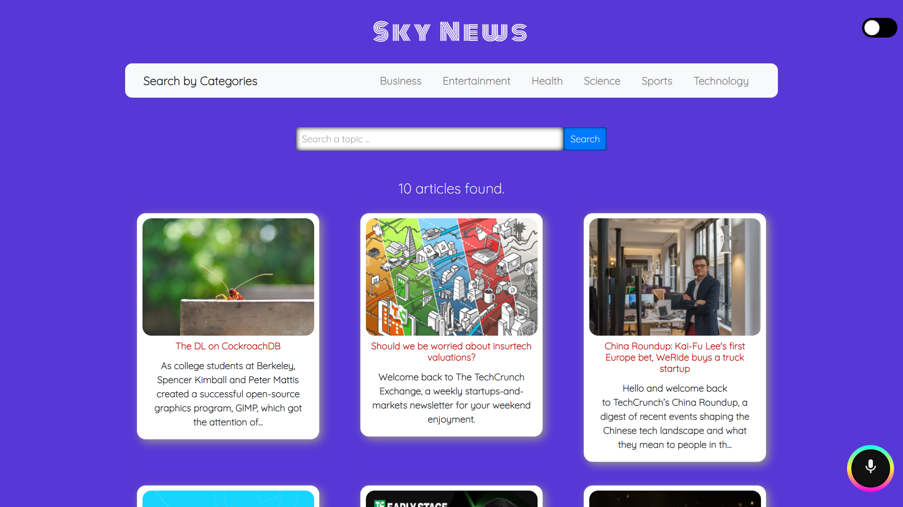
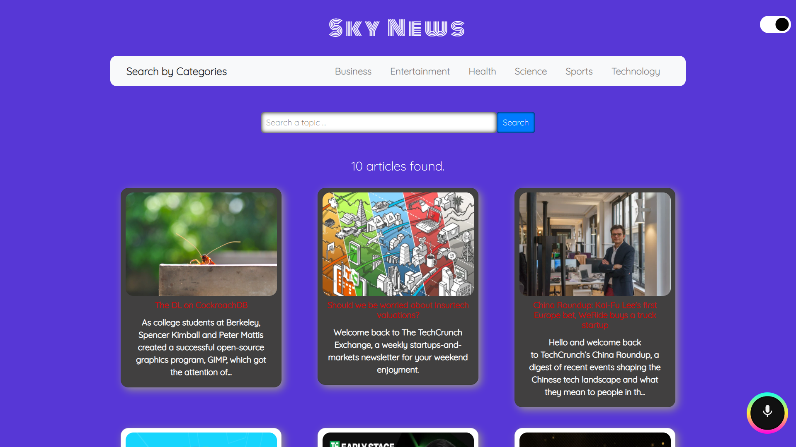
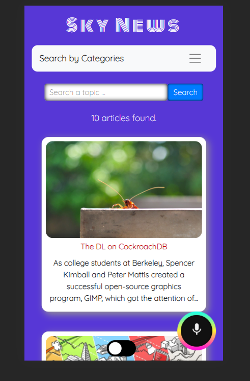

# **Voice Assistant News App using React**

- ### It's basically a voice-assistant news app where user can read any news.

---

- ### Either user can search the news by using searchbox or by using the voice search feature that I've provided.

---

- ### And user can read different categories of news as I have provided different options to user in *Navbar*.

---

- ### For the news data, I've used NewsAPI

  - [NewsAPI.org API](https://newsapi.org/)

  ***

- ### For the voice search feature , I've used speech-recognition i.e. a npm package
  - [speech-recognition API](https://www.npmjs.com/package/react-speech-recognition)

---

- ### I guess the free plan simply is not longer available in production that's why I haven't deployed the app.

---

### Screenshots of App

---

#### _Home Page_

#### _Theme Toggler_

#### _Mobile view_

## Getting Started with Create React App

---

This project was bootstrapped with [Create React App](https://github.com/facebook/create-react-app).

In the project directory, you can run:

### `yarn start`

Runs the app in the development mode.\
Open [http://localhost:3000](http://localhost:3000) to view it in the browser.

The page will reload if you make edits.\
You will also see any lint errors in the console.

### `yarn test`

Launches the test runner in the interactive watch mode.\
See the section about [running tests](https://facebook.github.io/create-react-app/docs/running-tests) for more information.

### `yarn build`

Builds the app for production to the `build` folder.\
It correctly bundles React in production mode and optimizes the build for the best performance.

The build is minified and the filenames include the hashes.\
Your app is ready to be deployed!

See the section about [deployment](https://facebook.github.io/create-react-app/docs/deployment) for more information.
